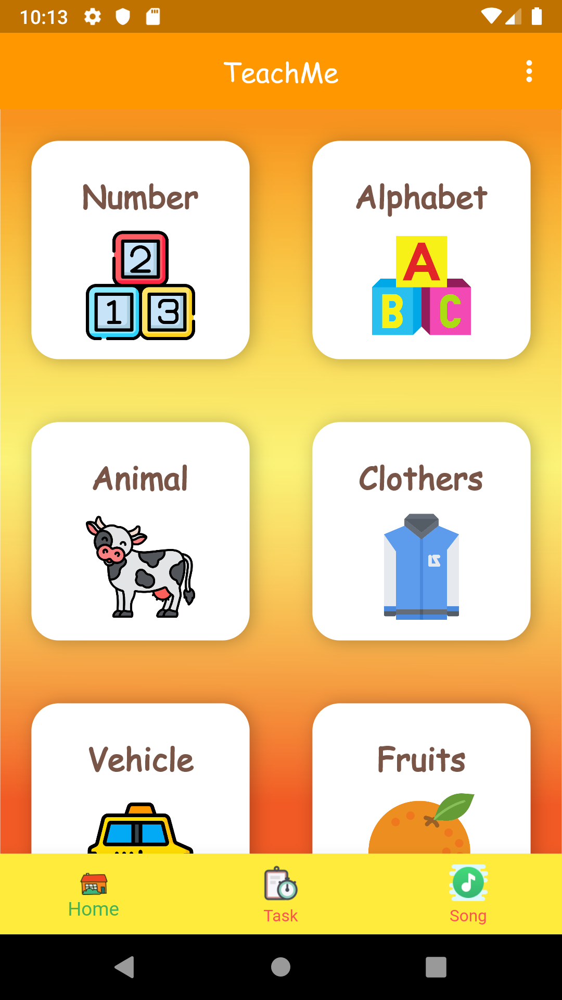
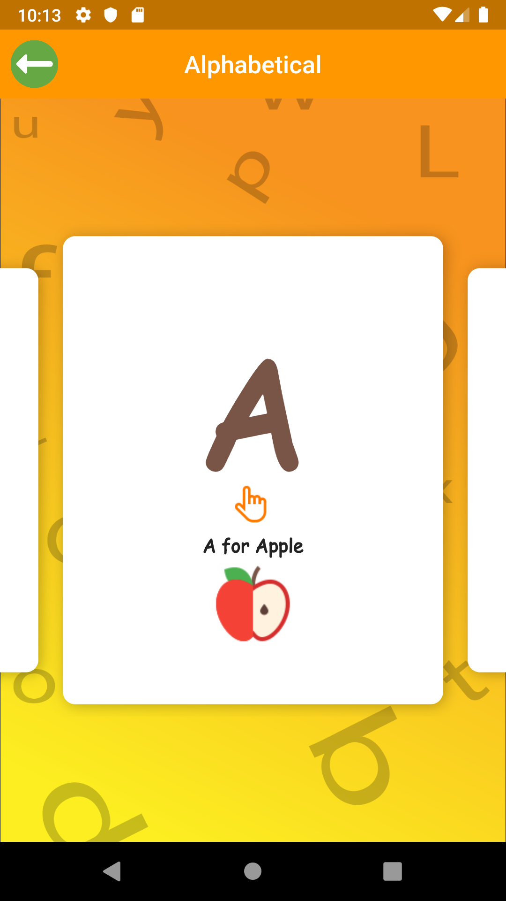
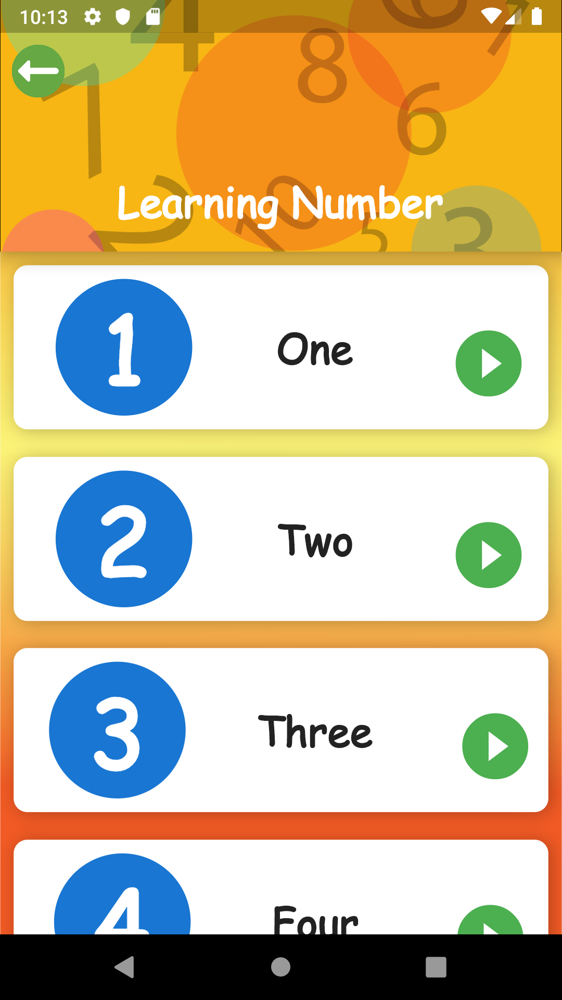

# Teach App

**TeachMe Application**

### Show some :heart: :like: and star the repo to support the project

## Screen Short
  

## Created and Maintained by

[Josiah Mpokera](https://github.com/Josiahmpokera) | [Instagram](https://www.instagram.com/josiah__yesayah/) | [Twitter](https://twitter.com/Josiah_dev)

A few resources to get you started with **Flutter** if this is your first Flutter project:

- [Lab: Write your first Flutter app](https://flutter.dev/docs/get-started/codelab)
- [Cookbook: Useful Flutter samples](https://flutter.dev/docs/cookbook)

For help getting started with Flutter, view our
[online documentation](https://flutter.dev/docs), which offers tutorials,
samples, guidance on mobile development, and a full API reference.

:heart::heart::heart: **We** **love** **to** **Code**
